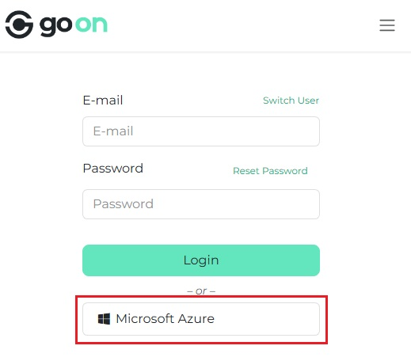

# Azure Entra ID SSO – Prompt for Account Selection

Odoo module that ensures the Microsoft Single Sign-On flow always prompts users to select an account when logging in with Azure Entra ID (formerly Azure Active Directory), developed by [Go On Associated](https://goonassociated.odoo.com/).

This module adds the *`prompt=select_account`* parameter to the Microsoft SSO login URL, allowing users to choose which Microsoft account to authenticate with. Without this parameter, the login flow may automatically select the first active session, which can cause confusion for users who manage multiple accounts. This enhancement ensures a more flexible and user-friendly login experience—particularly in environments where account switching is frequent.

---

## ✅ When should you use this module?

- You are using Odoo (SH or on-premises);
- You have integrated Microsoft Azure Entra ID (AD) for Single Sign-On;
- Your users may have multiple Microsoft accounts signed in on the same browser (e.g., personal, customer, or shared accounts).

---

## ⚙️ How to use this module

1. Follow Odoo’s [Microsoft Azure sign-in authentication guide](https://www.odoo.com/documentation/18.0/applications/general/users/azure.html) to register your Odoo app in your Azure tenant.
2. Configure the OAuth provider in Odoo using the Azure details.
3. Install this module to automatically add the `prompt=select_account` parameter to the Microsoft login URL.

No additional configuration is required.

---

## 🖼️ Login Screen Example

---

## 📄 License

This module is licensed under the **GNU Affero General Public License v3.0 (AGPL-3.0)**. See [LICENSE](./LICENSE) for full details.

---

## 🤝 Contact and Support

Developed by [Go On Associated](https://goonassociated.odoo.com/)

- 📬 [Contact us](https://goonassociated.odoo.com/contactus)
